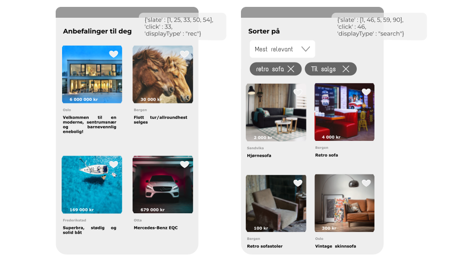
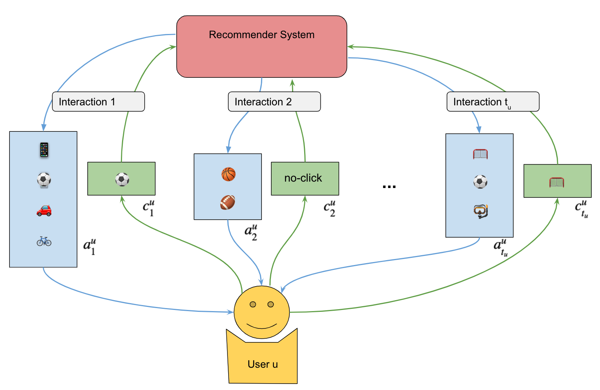

# FINN.no Slate Dataset for Recommender Systems
> Data and helper functions for FINN.no slate dataset containing both viewed items and clicks from the FINN.no second hand marketplace.


We release the *FINN.no slate dataset* to improve recommender systems research.
The dataset includes both search and recommendation interactions between users and the platform over a 30 day period.
The dataset has logged both exposures and clicks, *including interactions where the user did not click on any of the items in the slate*.
To our knowledge there exists no such large-scale dataset, and we hope this contribution can help researchers constructing improved models and improve offline evaluation metrics.



For each user u and interaction step t we recorded all items in the visible slate  ) (up to the scroll length ), and the user's click response .
The dataset consists of 37.4 million interactions, |U| ≈ 2.3) million users and |I| ≈ 1.3 million items that belong to one of G = 290 item groups. For a detailed description of the data please see the [paper](https://arxiv.org/abs/2104.15046).



FINN.no is the leading marketplace in the Norwegian classifieds market and provides users with a platform to buy and sell general merchandise, cars, real estate, as well as house rentals and job offerings.
For questions, email simen.eide@finn.no or file an issue.

## Install

`pip install recsys_slates_dataset`

## How to use

To download the generic numpy data files:

```
from recsys_slates_dataset import data_helper
data_helper.download_data_files(data_dir="data")
```

Download and prepare data into ready-to-use PyTorch dataloaders:

``` python
from recsys_slates_dataset import dataset_torch
ind2val, itemattr, dataloaders = dataset_torch.load_dataloaders(data_dir="data")
```

## Organization
The repository is organized as follows:
- The dataset is placed in `data/` and stored using git-lfs. We also provide an automatic download function in the pip package (preferred usage).
- The code open sourced from the article ["Dynamic Slate Recommendation with Gated Recurrent Units and Thompson Sampling"](https://arxiv.org/abs/2104.15046) is found in (`code_eide_et_al21/`). However, we are in the process of making the data more generally available which makes the code incompatible with the current (newer) version of the data. Please use [the v1.0 release of the repository](https://github.com/finn-no/recsys-slates-dataset/tree/v1.0) for a compatible version of the code and dataset.

## Quickstart dataset [](https://colab.research.google.com/github/finn-no/recsys-slates-dataset/blob/main/examples/quickstart-finn-recsys-slate-data.ipynb)
We provide a quickstart Jupyter notebook that runs on Google Colab (quickstart-finn-recsys-slate-data.ipynb) which includes all necessary steps above.
It gives a quick introduction to how to use the dataset.

## Example training scripts
We provide an example training jupyter notebook that implements a matrix factorization model with categorical loss that can be found in `examples/`.
It is also runnable using Google Colab: [](https://colab.research.google.com/github/finn-no/recsys-slates-dataset/blob/main/examples/matrix_factorization.ipynb)  
There is ongoing work in progress to build additional examples and use them as benchmarks for the dataset.

### Dataset files
The dataset `data.npz` contains the following fields:
- userId: The unique identifier of the user.
- click: The items the user clicked on in each of the 20 presented slates.
- click_idx: The index the clicked item was on in each of the 20 presented slates.
- slate_lengths: The length of the 20 presented slates.
- slate: All the items in each of the 20 presented slates.
- interaction_type: The recommendation slate can be the result of a search query (1), a recommendation (2) or can be undefined (0).

The dataset `itemattr.npz` contains the categories ranging from 0 to 290. Corresponding with the 290 unique groups that the items belong to. These 290 unique groups are constructed using a combination of categorical information and the geographical location. 

The dataset  `ind2val.json` contains the mapping between the indices and the values of the categories (e.g. `"287": "JOB, Rogaland"`) and interaction types (e.g. `"1": "search"`).                                                                                                                                                                  
## Citations
This repository accompanies the paper ["Dynamic Slate Recommendation with Gated Recurrent Units and Thompson Sampling"](https://arxiv.org/abs/2104.15046) by Simen Eide, David S. Leslie and Arnoldo Frigessi.
The article is under review, and the preprint can be obtained [here](https://arxiv.org/abs/2104.15046).

If you use either the code, data or paper, please consider citing the paper.

```
@article{eide2021dynamic,
      title={Dynamic Slate Recommendation with Gated Recurrent Units and Thompson Sampling}, 
      author={Simen Eide and David S. Leslie and Arnoldo Frigessi},
      year={2021},
      eprint={2104.15046},
      archivePrefix={arXiv},
      primaryClass={stat.ML}
}
```

## Todo
This repository is currently *work in progress*, and we will provide descriptions and tutorials. Suggestions and contributions to make the material more available are welcome.
There are some features of the repository that we are working on:

- [ ] Add more usable functions that compute relevant metrics such as F1, counterfactual metrics etc.
- [ ] The git lfs is currently broken by removing some lines in .gitattributes that is in conflict with nbdev. The dataset is still usable using the building download functions as they use a different source. However, we should fix this. An issue is [posted on nbdev](https://github.com/fastai/nbdev/issues/506).
